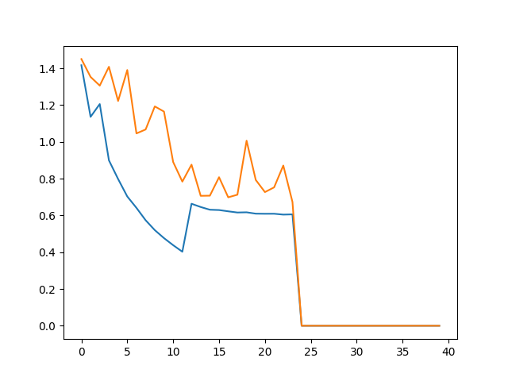
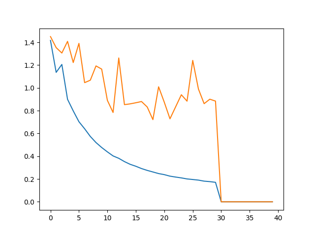
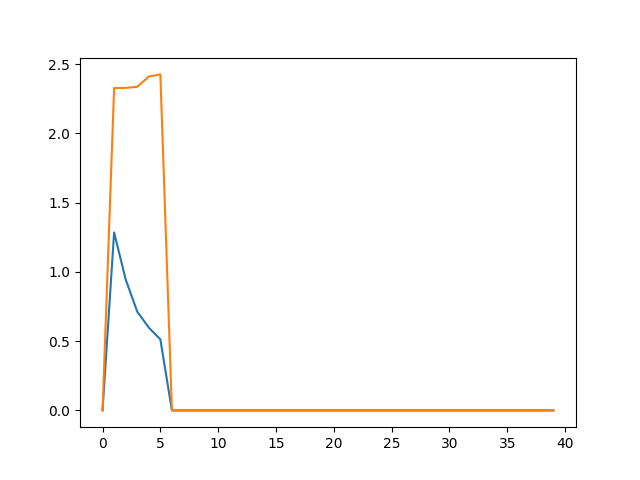

# This is about the Enlargement of the dataset.

The [matlab code](./generateDATA.m) to generate the data from SUN3D

The examples are extracted with interval 20, i.e. for t = t + 20 frames, we extract frame(t), frame(t-5) and frame(t+5). The beginning and the end of each video are dicarded. Gets train: 107417, val 5613

## first experiment:
use the first 30000 exaples in /train as the training data, the 5600 examples in /val as test data.

The experiment terminated after 11 epoches, with an errer seems related to the disc hardware.

I change the code the load up the trained model in epoch 11. But made a mistake that read it from another floder (i.e. another file). The subsequent training dosen't dicrease the loss: 

So the loss after epoch 11 is meaningless. It's much better than the first experiment of [Drop out](../Drop_out/figure_1.png). The test loss is still descending in epoch 11.

It's trained by Adadelta. Implemented Dropout.

**updated curve**

## experiment 2
An unsucessful experiment.

Don't understand why.
Use `optimizer=keras.optimizers.Adam(lr=0.0001, beta_1=0.9, beta_2=0.999, epsilon=1e-08, decay=0.0)`
Depress mean of input: `x[i,:,:,0:3] = xx['Data']['image'][0][0][0][0][16:464,:,:] - image_mean`
`x[i,:,:,3:6] = xx['Data']['image'][0][0][0][1][16:464,:,:] - image_mean` but made a mistake
